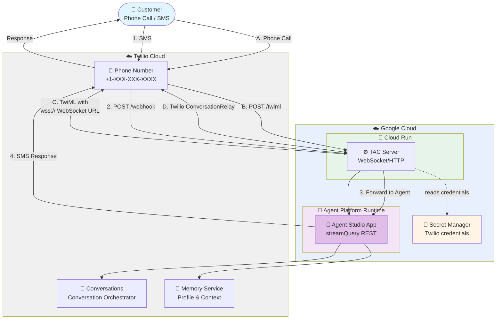

# TAC Agent Studio + Cloud Run Deployment

Deploy [Twilio Agent Connect (TAC)](https://www.twilio.com/docs/conversations/agent-connect)
— Twilio's framework for connecting AI agents to voice and messaging channels —
with an Agent Studio app on GCP Agent Platform Runtime and the TAC server on
Cloud Run.

The flow has two independently deployed pieces:
- **Agent** (`agent/`) — a source-code app built and deployed from the Agent
  Studio console (no `deploy.py` — see [`agent/README.md`](./agent/README.md)),
  hosted on Agent Platform Runtime (a.k.a. Reasoning Engine).
- **TAC server** (`server/`) — a FastAPI app that terminates Twilio webhooks +
  the ConversationRelay WebSocket and forwards turns to the agent, on Cloud Run.

The agent has **no knowledge of Twilio**; the server has **no LLM logic**.
`StudioAgentEngineConnector` is the seam between them — it talks to the agent
over the fixed `reasoningEngines:streamQuery` REST endpoint, since Studio apps
don't register SDK `query`/`stream_query` methods.

## Architecture



## Deployment Components

- **Agent** - the Agent Studio app, hosted on Agent Platform Runtime; built and deployed from the console — see [`agent/README.md`](./agent/README.md)
- **Cloud Run Service** - the TAC server (FastAPI), HTTP webhooks and WebSocket endpoints; deployed from [`server/`](./server/)
- **Artifact Registry** - holds the server's container image (created automatically)
- **Secret Manager** - holds the Twilio credentials, read by the Cloud Run service

## Prerequisites

### Required Tools

- **[Google Cloud CLI](https://cloud.google.com/sdk/docs/install)** - Command-line tool for GCP (`brew install --cask google-cloud-sdk`)
- **[Python 3.11](https://www.python.org/downloads/)** - to run the invoke test client (Agent Platform Runtime requires 3.11)

### GCP Account Requirements

- **Active GCP Project** with billing enabled and access to:
  - **Vertex AI** (Agent Platform Runtime) — enable it before deploying: `gcloud services enable aiplatform.googleapis.com cloudresourcemanager.googleapis.com`
  - **Cloud Run**, **Cloud Build**, and **Artifact Registry** (enabled automatically by `server/deploy.sh`)
- **Region:** Agent Studio currently stores and deploys agents in **us-west1** only — set `GOOGLE_CLOUD_LOCATION=us-west1` in `.env`

---

## Quick Start

### 1. Build and Deploy the Agent

Build and deploy the agent in the Agent Studio console — see
[`agent/README.md`](./agent/README.md). Save the deployed agent's resource ID.

### 2. Configure Environment

The invoke test client and the server share a **single `.env`** in this folder:

```bash
cd deploy/agent_platform/studio
cp .env.example .env
```

Edit `.env` with your values:

```bash
# GCP Configuration
GOOGLE_CLOUD_PROJECT=your-project-id
GOOGLE_CLOUD_LOCATION=us-west1
GCP_REASONING_ENGINE_ID=your-agent-id

# Twilio Credentials
TWILIO_ACCOUNT_SID=ACxxxxxxxxxxxxxxxxxxxxxxxxxxxxxxxx
TWILIO_AUTH_TOKEN=your_auth_token
TWILIO_API_KEY=SKxxxxxxxxxxxxxxxxxxxxxxxxxxxxxxxx
TWILIO_API_SECRET=your_api_secret

# Twilio Configuration
TWILIO_PHONE_NUMBER=+1234567890
TWILIO_CONVERSATION_CONFIGURATION_ID=conv_configuration_xxxx
```

**Where to find Twilio values:**
- Account SID & Auth Token: Twilio Console → Account → API keys & tokens
- API Key & Secret: Create new API Key
- Phone Number: Twilio Console → Phone Numbers
- Conversation Configuration ID: Twilio Console → Conversation Orchestrator

The four Twilio credentials (`TWILIO_ACCOUNT_SID`, `TWILIO_AUTH_TOKEN`,
`TWILIO_API_KEY`, `TWILIO_API_SECRET`) are stored in Secret Manager by the
deploy; the rest are passed as env vars.

### 3. Authenticate (one-time)

Run once per machine — the credentials persist for future deploys. The project
comes from `.env`, so you don't need `gcloud config set project`.

```bash
gcloud auth login                        # gcloud CLI (server deploy)
gcloud auth application-default login    # ADC (invoke test client)
```

### 4. Create the deploy service account (one-time)

Creates the dedicated `tac-deployer` SA (derived from your project — nothing to
configure). The deploy grants it the roles it needs.

```bash
make create-sa
```

### 5. Deploy

```bash
make deploy-all
```

`deploy-all` runs `deploy-secret`, then `deploy-server`. Or run the steps
individually: `make deploy-secret` / `make deploy-server`.

**Deployment output:**

```
✅ Deployed: https://tac-server-studio-xxxxx.<region>.run.app

Configure Twilio:
  Conversation Orchestrator status callback : https://tac-server-studio-xxxxx.<region>.run.app/webhook   (POST)
  Voice "A call comes in" webhook           : https://tac-server-studio-xxxxx.<region>.run.app/twiml     (POST)
```

Copy these webhook URLs for Twilio configuration. Re-running `make deploy-server`
keeps the same URL.

---

## Twilio Configuration

### Configure Voice Webhook (Phone Number)

1. Go to **Twilio Console → Phone Numbers → Active Numbers**
2. Select your phone number
3. Under "Voice Configuration":
   - **A CALL COMES IN:** Webhook
   - **URL:** Use the `/twiml` URL from deploy output
   - **HTTP Method:** POST
4. Save

### Configure Conversation Webhook (SMS/Messaging)

1. Go to **Twilio Console → Conversation Orchestrator**
2. Select your Conversation Configuration
3. Under "Webhook Configuration":
   - **Webhook URL:** Use the `/webhook` URL from deploy output
   - **HTTP Method:** POST
4. Save

**Note:** SMS flows through the Conversation Orchestrator status callback, **not** the phone number's "A message comes in" webhook. Setting the phone-number messaging webhook does nothing here — you must update the Conversation Configuration above.

---

## View Logs

### Cloud Run Logs

Application logs (startup, agent calls, errors):

```bash
gcloud run services logs read tac-server-studio --project your-project-id --region your-region --limit 50
```

Or go to the [Cloud Logging Console](https://console.cloud.google.com/logs), and filter by **Cloud Run Revision → `tac-server-studio`**.

### Request Logs

To confirm whether Twilio's webhook is **reaching** the service (and with what status code):

```bash
gcloud logging read \
  'resource.type="cloud_run_revision" AND resource.labels.service_name="tac-server-studio" AND httpRequest.requestUrl!=""' \
  --project your-project-id --limit 25 --freshness=1h \
  --format='table(timestamp, httpRequest.requestMethod, httpRequest.status, httpRequest.requestUrl)'
```

---

## Update Code

- After editing the agent: redeploy from the Agent Studio console.
- After editing the server or the package: `make deploy-server`.
- After rotating Twilio credentials in `.env`: `make deploy-secret`.
