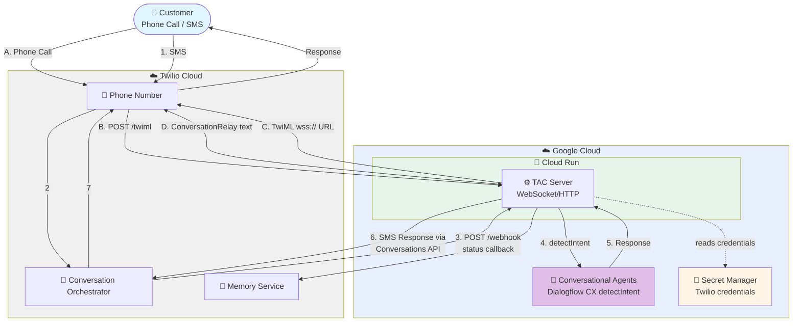

# TAC Conversational Agents (Dialogflow CX) + Cloud Run Deployment

Connect Twilio Voice and SMS to an agent built in **Conversational Agents**
(Dialogflow CX). The agent is built in the console; a TAC server on Cloud Run
bridges Twilio to it over the Dialogflow CX `detectIntent` API.

The agent has **no knowledge of Twilio**; the server has **no LLM logic**. The
`ConversationalAgentsConnector` is the seam between them. Twilio ConversationRelay
does the speech, so only text is exchanged and Dialogflow keeps the conversation
history server-side (per session id).

## Architecture



## Deployment Components

- **Agent** - built in the Conversational Agents console; see [`agent/`](./agent/)
- **Cloud Run Service** - the TAC server (FastAPI), HTTP webhooks and WebSocket endpoints; deployed from [`server/`](./server/)
- **Artifact Registry** - holds the server's container image (created automatically)
- **Secret Manager** - holds the Twilio credentials, read by the Cloud Run service

## Prerequisites

- **[Google Cloud CLI](https://cloud.google.com/sdk/docs/install)** installed and authenticated
- An agent built in **Conversational Agents** (see [`agent/`](./agent/))
- A GCP project with **Cloud Run**, **Cloud Build**, and **Artifact Registry** available (enabled automatically by `server/deploy.sh`)
- The Cloud Run runtime service account needs **`roles/dialogflow.client`** to call the agent (granted by `server/deploy.sh`)

## Quick Start

### 1. Build the agent

Follow [`agent/README.md`](./agent/README.md) to build the agent in the console
and copy its resource name.

### 2. Configure environment

```bash
cd deploy/conversational_agents
cp .env.example .env
# fill in GOOGLE_CLOUD_PROJECT, GOOGLE_CLOUD_LOCATION, CONVERSATIONAL_AGENT_ID, and Twilio creds
```

### 3. Authenticate (one-time)

```bash
gcloud auth login
gcloud auth application-default login
```

### 4. Create the deploy service account (one-time)

```bash
make create-sa
```

### 5. Deploy

```bash
make deploy-all      # store Twilio secrets, then build + deploy the server
```

Or run the steps individually: `make deploy-secret` / `make deploy-server`.

`deploy-server` prints the webhook URLs to set in Twilio:

- Conversation Orchestrator status callback → `https://<service-url>/webhook`
- Voice "A call comes in" → `https://<service-url>/twiml`

## Twilio Configuration

- **Voice** (Phone Number → "A call comes in"): the `/twiml` URL, POST.
- **SMS** (Conversation Orchestrator → your configuration → status callback): the `/webhook` URL, POST. SMS flows through the Conversation Orchestrator status callback, **not** the phone number's "A message comes in" webhook.

## View Logs

```bash
gcloud run services logs read tac-df-server --project your-project-id --region your-region --limit 50
```
