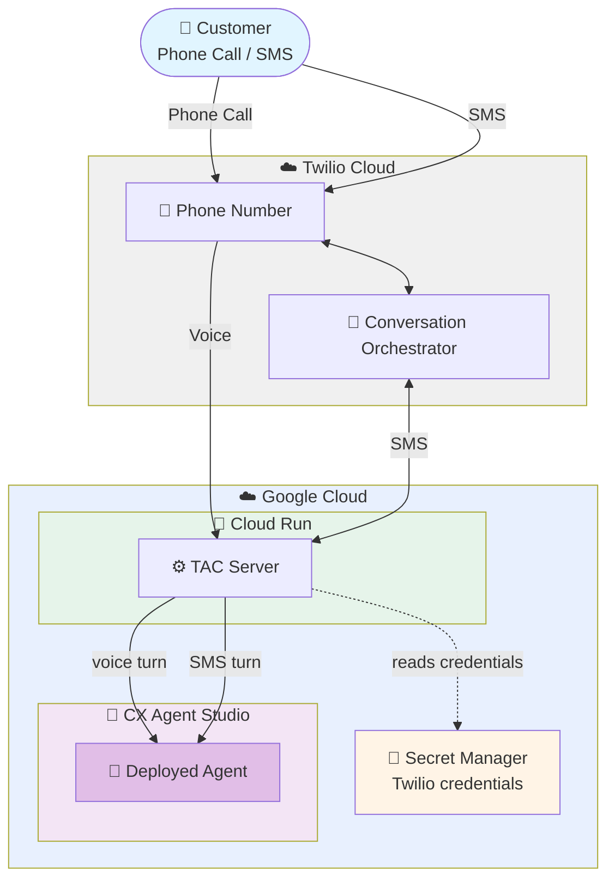

# TAC CX Agent Studio + Cloud Run Deployment

Deploy Twilio Agent Connect with an agent built in **CX Agent Studio**
(Customer Engagement Suite) and the TAC server on Cloud Run.

The flow has two independently deployed pieces:
- **Agent** — built and deployed in the CX Agent Studio console (no code here).
- **TAC server** — a FastAPI app that terminates Twilio webhooks and forwards
  turns/audio to the agent, on Cloud Run.

[`server/main.py`](./server/main.py) supports two voice approaches — switch
between them by editing that one file (see the comments in it):

| | cascaded (default) | s2s |
|---|---|---|
| Voice | ConversationRelay — Twilio does the STT/TTS | Media Streams carries raw audio |
| Voice + Conversation Orchestrator / TAC Memory | Yes / Yes | No / No |
| SMS | Yes (Conversation Orchestrator, TAC Memory) | Yes (Conversation Orchestrator, TAC Memory) |

## Architecture



## Deployment Components

- **Agent** - built and deployed in the CX Agent Studio console; see [`agent/`](./agent/)
- **Cloud Run Service** - the TAC server (FastAPI); deployed from [`server/`](./server/)
- **Artifact Registry** - holds the server's container image (created automatically)
- **Secret Manager** - holds the Twilio credentials, read by the Cloud Run service

## Prerequisites

### Required Tools

- **[Google Cloud CLI](https://cloud.google.com/sdk/docs/install)** - Command-line tool for GCP (`brew install --cask google-cloud-sdk`)
- **[Python 3.11](https://www.python.org/downloads/)** - only to run the optional local test client (`agent/invoke.py`)

### GCP Account Requirements

- **Active GCP Project** with billing enabled and access to:
  - **CX Agent Studio** (Customer Engagement Suite) — build the agent there first (see [`agent/`](./agent/))
  - **Cloud Run**, **Cloud Build**, and **Artifact Registry** (enabled automatically by `server/deploy.sh`)
- The Cloud Run runtime service account needs **`roles/ces.client`** to call the agent (granted by `server/deploy.sh`)
- **Region:** any region with Cloud Run availability — set it via `GOOGLE_CLOUD_LOCATION` in `.env` (the agent itself lives in the CX Agent Studio `us` multi-region, independent of this)

---

## Quick Start

### 1. Build the agent

Build and deploy the agent in the CX Agent Studio console and copy its resource
name, following [`agent/README.md`](./agent/README.md).

### 2. Configure Environment

```bash
cd deploy/cx_agent_studio
cp .env.example .env
```

Edit `.env` with your values:

```bash
# GCP Configuration
GOOGLE_CLOUD_PROJECT=your-project-id
GOOGLE_CLOUD_LOCATION=your-region

# CX Agent Studio agent (from the console; location is the CX Agent Studio `us` multi-region)
CX_AGENT_ID=projects/your-project/locations/us/apps/your-app-id

# Twilio Credentials
TWILIO_ACCOUNT_SID=ACxxxxxxxxxxxxxxxxxxxxxxxxxxxxxxxx
TWILIO_AUTH_TOKEN=your_auth_token
TWILIO_API_KEY=SKxxxxxxxxxxxxxxxxxxxxxxxxxxxxxxxx
TWILIO_API_SECRET=your_api_secret

# Twilio Configuration
TWILIO_PHONE_NUMBER=+1234567890
TWILIO_CONVERSATION_CONFIGURATION_ID=conv_configuration_xxxx
```

**Where to find Twilio values:**
- Account SID & Auth Token: Twilio Console → Account → API keys & tokens
- API Key & Secret: Create new API Key
- Phone Number: Twilio Console → Phone Numbers
- Conversation Configuration ID: Twilio Console → Conversation Orchestrator

The four Twilio credentials (`TWILIO_ACCOUNT_SID`, `TWILIO_AUTH_TOKEN`,
`TWILIO_API_KEY`, `TWILIO_API_SECRET`) are stored in Secret Manager by the
deploy; the rest are passed as env vars.

### 3. Authenticate (one-time)

Run once per machine — the credentials persist for future deploys. The project
comes from `.env`, so you don't need `gcloud config set project`.

```bash
gcloud auth login                        # gcloud CLI (server deploy)
gcloud auth application-default login    # ADC (local invoke.py)
```

### 4. Create the deploy service account (one-time)

Creates the dedicated `tac-deployer` SA (derived from your project — nothing to
configure). The deploy grants it the roles it needs.

```bash
make create-sa
```

### 5. (Optional) Switch voice approach

`server/main.py` defaults to **cascaded** (ConversationRelay). To use **s2s**
(native speech-to-speech) instead, open that file and follow the comments —
comment out the "cascaded" block, uncomment the "s2s" block.

### 6. Deploy

One command stores the secrets and deploys the server:

```bash
make deploy-all
```

`deploy-all` runs `deploy-secret`, then `deploy-server`. Or run the steps
individually: `make deploy-secret` / `make deploy-server`.

**Deployment output:**

```
✅ Deployed: https://tac-cx-server-xxxxx.<region>.run.app

Configure Twilio:
  Conversation Orchestrator status callback : https://tac-cx-server-xxxxx.<region>.run.app/webhook   (POST)
  Voice "A call comes in" webhook           : https://tac-cx-server-xxxxx.<region>.run.app/twiml     (POST)
```

Copy these webhook URLs for Twilio configuration. Re-running `make deploy-server`
keeps the same URL — including after switching between cascaded/s2s in `main.py`.

---

## Twilio Configuration

### Configure Voice Webhook (Phone Number)

1. Go to **Twilio Console → Phone Numbers → Active Numbers**
2. Select your phone number
3. Under "Voice Configuration":
   - **A CALL COMES IN:** Webhook
   - **URL:** Use the `/twiml` URL from deploy output
   - **HTTP Method:** POST
4. Save

### Configure Conversation Webhook (SMS/Messaging)

1. Go to **Twilio Console → Conversation Orchestrator**
2. Select your Conversation Configuration
3. Under "Webhook Configuration":
   - **Webhook URL:** Use the `/webhook` URL from deploy output
   - **HTTP Method:** POST
4. Save

**Note:** SMS flows through the Conversation Orchestrator status callback, **not** the phone number's "A message comes in" webhook. Setting the phone-number messaging webhook does nothing here — you must update the Conversation Configuration above.

---

## View Logs

### Cloud Run Logs

Application logs (startup, agent calls, errors):

```bash
gcloud run services logs read tac-cx-server --project your-project-id --region your-region --limit 50
```

Or go to the [Cloud Logging Console](https://console.cloud.google.com/logs), and filter by **Cloud Run Revision → `tac-cx-server`**.

### Request Logs

To confirm whether Twilio's webhook is **reaching** the service (and with what status code):

```bash
gcloud logging read \
  'resource.type="cloud_run_revision" AND resource.labels.service_name="tac-cx-server" AND httpRequest.requestUrl!=""' \
  --project your-project-id --limit 25 --freshness=1h \
  --format='table(timestamp, httpRequest.requestMethod, httpRequest.status, httpRequest.requestUrl)'
```

---

## Update Code

- After editing the agent: rebuild/redeploy it in the CX Agent Studio console.
- After editing the server or the package (including switching cascaded/s2s): `make deploy-server`.
- After rotating Twilio credentials in `.env`: `make deploy-secret`.
