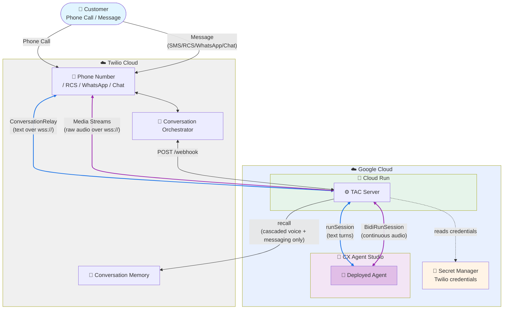

# Connect Twilio to CX Agent Studio

[Twilio Agent Connect (TAC)](https://www.twilio.com/docs/conversations/agent-connect)
connects AI agents to Twilio's voice and messaging channels. This deploys it on
Cloud Run, wired to an agent built in **CX Agent Studio** (Customer Engagement
Suite).

Two pieces deploy independently:

- **The agent** (not in this repo), built and deployed in the Google Cloud
  console. See [`agent/`](./agent/) for how to create it.
- **The TAC server** (this repo), a FastAPI app that connects Twilio's voice and
  messaging channels to your agent. Deployed to Cloud Run from
  [`server/`](./server/).

## Architecture

Voice can run **cascaded**, where Twilio does the speech-to-text and
text-to-speech and your agent only ever sees text, or **speech-to-speech**, where
raw call audio streams to the agent.

|                                                         | cascaded (default)                       | speech-to-speech (`s2s`)                  |
| ------------------------------------------------------- | ---------------------------------------- | ----------------------------------------- |
| What carries the call                                   | ConversationRelay, text over a WebSocket | Media Streams, raw audio over a WebSocket |
| Who does the STT/TTS                                    | Twilio                                   | CX Agent Studio                           |
| Agent API                                               | `runSession` (text)                      | `BidiRunSession` (audio)                  |
| Voice + Conversation Orchestrator / Conversation Memory | Yes / Yes                                | No / No                                   |

[`server/main.py`](./server/main.py) picks which one you get, and switching is a
one-file edit (see [step 5](#5-optional-switch-voice-approach)).

Below, blue edges are the cascaded voice path, purple speech-to-speech; black
edges are common to both.



## Deployment Components

- **Agent** - built and deployed in CX Agent Studio in the Google Cloud console; see [`agent/`](./agent/)
- **Cloud Run Service** - the TAC server (FastAPI); deployed from [`server/`](./server/)
- **Artifact Registry** - holds the server's container image (created automatically)
- **Secret Manager** - holds the Twilio credentials, read by the Cloud Run service

## Prerequisites

### Local Requirements

| What             | Where                                                                                                | Needed for                                        |
| ---------------- | ---------------------------------------------------------------------------------------------------- | ------------------------------------------------- |
| Google Cloud CLI | [install docs](https://cloud.google.com/sdk/docs/install), or `brew install --cask google-cloud-sdk` | every deploy step                                 |
| Python 3.11      | [python.org](https://www.python.org/downloads/)                                                      | only the optional debug client, `agent/invoke.py` |

### Google Cloud Requirements

| What                                                    | Where                                             | .env value              |
| ------------------------------------------------------- | ------------------------------------------------- | ----------------------- |
| Project with billing and CX Agent Studio access         | [Cloud Console](https://console.cloud.google.com) | `GOOGLE_CLOUD_PROJECT`  |
| Region with Cloud Run availability                      | any                                               | `GOOGLE_CLOUD_LOCATION` |
| Deployed agent, **Set up API access** on its Deploy tab | [`agent/README.md`](./agent/README.md)            | `CX_AGENT_ID`           |

The deploy scripts handle API enablement and both service accounts.

### Twilio Requirements

| What                                                                 | Where ([Twilio Console](https://1console.twilio.com))                                  | .env value                                          |
| -------------------------------------------------------------------- | -------------------------------------------------------------------------------------- | --------------------------------------------------- |
| Account SID (starts `AC`)                                            | Console Dashboard                                                                      | `TWILIO_ACCOUNT_SID`                                |
| Auth Token                                                           | **Develop > API Key & creds > API Keys & auth tokens > Auth Tokens** tab               | `TWILIO_AUTH_TOKEN`                                 |
| API Key + Secret                                                     | same page, **API Keys** tab, **Create API Key**. The secret shows once, so copy it now | `TWILIO_API_KEY` (starts `SK`), `TWILIO_API_SECRET` |
| Phone number, voice-capable (also SMS-capable if you want messaging) | **Products & services > Numbers & senders**                                            | `TWILIO_PHONE_NUMBER` (E.164)                       |

That's everything voice needs.

#### Optional

| What                       | Where                                                                                                                                                          | .env value                                     | Enables                                                   |
| -------------------------- | -------------------------------------------------------------------------------------------------------------------------------------------------------------- | ---------------------------------------------- | --------------------------------------------------------- |
| Conversation Configuration | [Conversation Orchestrator quickstart](https://www.twilio.com/docs/conversations/orchestrator/quickstart#create-a-memory-store-and-conversation-configuration) | `TWILIO_CONVERSATION_CONFIGURATION_ID`         | messaging and Conversation Memory; without it, voice only |
| RCS sender                 | **Products & services > Numbers & senders**                                                                                                                    | `TWILIO_RCS_SENDER_ID`                         | the RCS channel                                           |
| WhatsApp sender            | **Products & services > Numbers & senders**                                                                                                                    | `TWILIO_WHATSAPP_NUMBER` (`whatsapp:+1555...`) | the WhatsApp channel                                      |

Leave the Conversation Configuration's webhook blank for now. It needs the Cloud
Run host, which you get after the first deploy
([Twilio Configuration](#configure-conversation-webhook-messaging)).

To message numbers beyond your own test numbers, SMS needs a registered brand
and campaign and RCS needs carrier approval. Both go through Twilio and both
block end-to-end testing, so start early.

---

## Quick Start

### 1. Build the agent

Build and deploy the agent in CX Agent Studio and copy its resource name,
following [`agent/README.md`](./agent/README.md).

### 2. Configure Environment

```bash
cd deploy/cx_agent_studio
cp .env.example .env
```

Edit `.env` with your values:

```bash
# GCP Configuration
GOOGLE_CLOUD_PROJECT=your-project-id
GOOGLE_CLOUD_LOCATION=your-region

# CX Agent Studio agent (from the console; location is the CX Agent Studio `us` multi-region)
CX_AGENT_ID=projects/your-project/locations/us/apps/your-app-id

# Twilio Credentials
TWILIO_ACCOUNT_SID=ACxxxxxxxxxxxxxxxxxxxxxxxxxxxxxxxx
TWILIO_AUTH_TOKEN=your_auth_token
TWILIO_API_KEY=SKxxxxxxxxxxxxxxxxxxxxxxxxxxxxxxxx
TWILIO_API_SECRET=your_api_secret

# Twilio Configuration
TWILIO_PHONE_NUMBER=+1234567890
TWILIO_CONVERSATION_CONFIGURATION_ID=conv_configuration_xxxx

# Optional: set either one to enable that messaging channel
TWILIO_RCS_SENDER_ID=rcs_sender_xxxxxxxxxxxxxxxxxx
TWILIO_WHATSAPP_NUMBER=whatsapp:+1234567890
```

Console paths for all of these are in
[Twilio Requirements](#twilio-requirements). The four credentials
(`TWILIO_ACCOUNT_SID`, `TWILIO_AUTH_TOKEN`, `TWILIO_API_KEY`,
`TWILIO_API_SECRET`) go into Secret Manager; the rest are passed as env vars.

### 3. Authenticate (one-time)

Run once per machine; the credentials persist for future deploys. The project
comes from `.env`, so you don't need `gcloud config set project`.

```bash
gcloud auth login                        # gcloud CLI (server deploy)
gcloud auth application-default login    # ADC (local invoke.py)
```

### 4. Create the deploy service account (one-time)

Creates the `tac-deployer` SA, derived from your project, with nothing to
configure. The deploy grants it the roles it needs.

```bash
make create-sa
```

### 5. (Optional) Switch voice approach

`server/main.py` defaults to cascaded. For speech-to-speech, open it and follow
the comments: comment out the "cascaded" block, uncomment the "s2s" block.
Speech-to-speech voice supports neither Conversation Orchestrator nor
Conversation Memory. Messaging keeps both either way.

### 6. Deploy

```bash
make deploy-all
```

`deploy-all` runs `deploy-secret`, then `deploy-server`. You can also run those
individually.

**Deployment output:**

```
✅ Deployed: https://tac-cx-server-xxxxx.<region>.run.app

Configure Twilio:
  Conversation Orchestrator status callback : https://tac-cx-server-xxxxx.<region>.run.app/webhook   (POST)
  Voice "A call comes in" webhook           : https://tac-cx-server-xxxxx.<region>.run.app/twiml     (POST)
```

Copy those webhook URLs for the next section. Re-running `make deploy-server`
keeps the same URL, including after switching cascaded/s2s.

---

## Twilio Configuration

### Configure Voice Webhook (Phone Number)

1. Go to **Products & services > Numbers & senders**
2. Select your phone number
3. Under **Voice configuration**, set the primary handler:
   - **A CALL COMES IN:** Webhook
   - **URL:** the `/twiml` URL from the deploy output
   - **HTTP Method:** POST
4. Save

Both voice approaches use this same `/twiml` webhook, so there's nothing to
change here when you switch.

### Configure Conversation Webhook (Messaging)

1. Go to **Products & services > Conversation Orchestrator > Conversation Configurations**
2. Select your Conversation Configuration and click **Edit**
3. Under **Webhook**, set the callback URL to the `/webhook` URL from the deploy
   output, method POST
4. Save

If you created the configuration via the API with `statusCallbacks` already
pointing at your Cloud Run URL, this is done already.

Messaging flows through the Conversation Orchestrator status callback, **not** the
phone number's "A message comes in" webhook. Setting that one does nothing here.
This single webhook covers SMS, Chat, RCS, and WhatsApp.

---

## View Logs

### Cloud Run Logs

Application logs (startup, agent calls, errors):

```bash
gcloud run services logs read tac-cx-server --project your-project-id --region your-region --limit 50
```

Or go to the [Cloud Logging Console](https://console.cloud.google.com/logs), and filter by **Cloud Run Revision → `tac-cx-server`**.

### Request Logs

To confirm whether Twilio's webhook is **reaching** the service (and with what status code):

```bash
gcloud logging read \
  'resource.type="cloud_run_revision" AND resource.labels.service_name="tac-cx-server" AND httpRequest.requestUrl!=""' \
  --project your-project-id --limit 25 --freshness=1h \
  --format='table(timestamp, httpRequest.requestMethod, httpRequest.status, httpRequest.requestUrl)'
```

---

## Troubleshooting

| Symptom                                    | Cause                                                                                                                                                                                                                                                                                                                         |
| ------------------------------------------ | ----------------------------------------------------------------------------------------------------------------------------------------------------------------------------------------------------------------------------------------------------------------------------------------------------------------------------- |
| Every webhook 403s                         | `TWILIO_AUTH_TOKEN` doesn't belong to `TWILIO_ACCOUNT_SID`. Usually the token was rotated without re-running `make deploy-secret`, or the two come from different (sub)accounts. The [request log query](#request-logs) shows these.                                                                                          |
| Calls connect, nobody speaks               | `TWILIO_VOICE_PUBLIC_DOMAIN` was overridden in `.env`. The deploy sets it to the Cloud Run host, so an override points Twilio's `wss://` at the wrong place. Cloud Run logs show no WebSocket connection at all.                                                                                                              |
| Messages reach Twilio, agent never replies | No `TWILIO_CONVERSATION_CONFIGURATION_ID` set, so messaging was never enabled; or the configuration's webhook isn't `/webhook`; or the channel has no capture rule in the Conversation Configuration (WhatsApp is the common miss); or the channel isn't registered in `server/main.py`, in which case it's dropped silently. |
| RCS/WhatsApp works for your number only    | The approval gate, not a bug. See [Twilio Requirements](#optional).                                                                                                                                                                                                                                                           |

---

## Update Code

- After editing the agent: rebuild/redeploy it in CX Agent Studio.
- After editing the server or the package (including switching cascaded/s2s): `make deploy-server`.
- After rotating Twilio credentials in `.env`: `make deploy-secret`.
